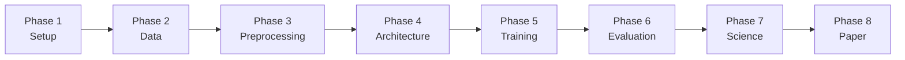

# Complete Implementation Workflow: Physics-Informed Cross-Band Prediction

## Overview


This document lays out the **entire end-to-end workflow** for implementing a Physics-Informed Neural Network (PINN) that predicts unseen photometric bands from multi-band astronomical imaging (SDSS *ugriz*), including the anomaly detection application.



**Estimated timeline:** 4–6 months from start to submission-ready manuscript.

---

## Phase 1: Environment & Tooling Setup

### 1.1 Project Structure

```
band-prediction/
├── config/
│   ├── default.yaml              # Hyperparameters, paths, filter specs
│   └── experiment/               # Per-experiment overrides
├── data/
│   ├── raw/                      # Raw FITS files from SDSS
│   ├── processed/                # Preprocessed cutouts (HDF5 or NumPy)
│   ├── catalogs/                 # CSV/FITS tables (coordinates, metadata)
│   └── filters/                  # SDSS filter response curves
├── src/
│   ├── data/
│   │   ├── download.py           # SDSS data acquisition
│   │   ├── preprocess.py         # Cutout extraction, normalization
│   │   └── dataset.py            # PyTorch Dataset / DataLoader
│   ├── models/
│   │   ├── unet.py               # U-Net generator
│   │   ├── discriminator.py      # PatchGAN discriminator
│   │   ├── pinn_loss.py          # Physics-informed loss functions
│   │   └── uncertainty.py        # MC-Dropout / ensemble uncertainty
│   ├── training/
│   │   ├── trainer.py            # Training loop
│   │   └── callbacks.py          # Logging, checkpointing, LR scheduling
│   ├── evaluation/
│   │   ├── metrics.py            # PSNR, SSIM, MAE
│   │   ├── astro_metrics.py      # Gini, M20, Sérsic, color-magnitude
│   │   └── anomaly.py            # Residual analysis, outlier flagging
│   └── utils/
│       ├── sed.py                # SED template handling (FSPS integration)
│       └── visualization.py      # Plotting utilities
├── notebooks/
│   ├── 01_data_exploration.ipynb
│   ├── 02_model_training.ipynb
│   ├── 03_evaluation.ipynb
│   └── 04_anomaly_analysis.ipynb
├── scripts/
│   ├── download_sdss.py
│   ├── train.py
│   └── evaluate.py
├── results/
│   ├── checkpoints/
│   ├── figures/
│   └── anomalies/
├── requirements.txt
└── README.md
```

### 1.2 Core Dependencies

```
# Deep Learning
torch>=2.0
torchvision
torchmetrics

# Astronomy
astropy
astroquery
python-fsps          # Stellar population synthesis
speclite             # Filter response curves
photutils            # Source extraction, morphology
statmorph            # Gini, M20, Sérsic fitting
sep                  # Source Extraction (C-based, fast)

# Data / Compute
numpy
scipy
h5py                 # Efficient storage of image arrays
pandas
scikit-learn

# Visualization
matplotlib
seaborn

# Experiment tracking
wandb                # or tensorboard

# Configuration
hydra-core
omegaconf
```

### 1.3 Hardware Requirements

| Component | Minimum | Recommended |
|-----------|---------|-------------|
| GPU | RTX 3060 (12 GB) | RTX 4090 (24 GB) or A100 |
| RAM | 32 GB | 64 GB |
| Storage | 500 GB SSD | 1 TB NVMe |
| CPU | 8-core | 16-core |

> [!TIP]
> If you don't have a local GPU, use **Google Colab Pro** (A100), **SciServer Compute** (free, data co-located with SDSS), or a university HPC cluster.

---

## Phase 2: Data Acquisition

### 2.1 Source Selection Strategy

You need a **well-defined sample** of astronomical objects. I recommend two tiers:

**Tier 1 — Galaxy sample (primary):**
- Start with **Galaxy Zoo 2** (GZ2) classifications cross-matched with SDSS DR17
- ~240,000 galaxies with morphological labels
- Gives you a clean, well-studied sample with rich metadata

**Tier 2 — All-source sample (extension):**
- Stars + galaxies + QSOs from SDSS spectroscopic catalog
- ~4 million objects
- For testing generalization and anomaly detection at scale

### 2.2 SDSS Data Download

#### Option A: Astroquery + Cutout2D (small-medium samples)

```python
from astroquery.sdss import SDSS
from astropy.coordinates import SkyCoord
from astropy.nddata import Cutout2D
import astropy.units as u

def download_cutouts(ra, dec, size_arcsec=64, bands=['u','g','r','i','z']):
    """Download SDSS FITS cutouts for all 5 bands."""
    coord = SkyCoord(ra=ra, dec=dec, unit='deg')
    
    # Query SDSS for the field containing this object
    xid = SDSS.query_region(coord, radius=2*u.arcsec,
                            spectro=False,
                            photoobj_fields=['objID','run','rerun','camcol','field'])
    
    if xid is None:
        return None
    
    cutouts = {}
    for band in bands:
        # Download the FITS frame
        images = SDSS.get_images(matches=xid, band=band)
        
        # Extract cutout centered on the target
        wcs = WCS(images[0][0].header)
        cutout = Cutout2D(images[0][0].data, coord, 
                          size_arcsec * u.arcsec, wcs=wcs)
        cutouts[band] = cutout.data
    
    return cutouts
```

#### Option B: SciServer (bulk, recommended for >10k objects)

```python
# Run this inside a SciServer Compute container
import SciServer.CasJobs as CasJobs

# SQL query to select galaxies from Galaxy Zoo 2
query = """
SELECT TOP 100000
    p.objID, p.ra, p.dec,
    p.run, p.rerun, p.camcol, p.field,
    p.petroMag_u, p.petroMag_g, p.petroMag_r, 
    p.petroMag_i, p.petroMag_z,
    p.petroR50_r,         -- half-light radius (arcsec)
    s.z AS redshift,      -- spectroscopic redshift
    s.class AS spec_class  -- STAR, GALAXY, QSO
FROM PhotoObjAll AS p
JOIN SpecObjAll AS s ON p.objID = s.bestObjID
WHERE
    s.class = 'GALAXY'
    AND s.zWarning = 0
    AND p.clean = 1
    AND p.petroMag_r BETWEEN 14 AND 17.77  -- bright, well-resolved
    AND p.petroR50_r > 3.0                  -- extended (> 3 arcsec)
ORDER BY NEWID()  -- random sample
"""
catalog = CasJobs.executeQuery(query, context='DR17')
```

### 2.3 Filter Response Curves

Download the official SDSS filter transmission curves for the physics-informed loss:

```python
import speclite.filters

# Load SDSS 2010 filter set (includes atmosphere at airmass 1.3)
sdss_filters = speclite.filters.load_filters(
    'sdss2010-u', 'sdss2010-g', 'sdss2010-r', 'sdss2010-i', 'sdss2010-z'
)

# Each filter has .wavelength (Å) and .response arrays
for f in sdss_filters:
    print(f"{f.name}: λ_eff = {f.effective_wavelength:.0f} Å")
```

| Band | λ_eff (Å) | FWHM (Å) | Primary Astrophysical Tracer |
|------|-----------|-----------|------------------------------|
| *u*  | 3551      | 599       | Young stars, AGN, Balmer break |
| *g*  | 4686      | 1379      | Stellar populations, 4000Å break |
| *r*  | 6166      | 1382      | Stellar mass proxy |
| *i*  | 7480      | 1535      | Older stellar populations |
| *z*  | 8932      | 1370      | Red/evolved stars, high-z objects |

---

## Phase 3: Data Preprocessing

### 3.1 Cutout Extraction & Quality Control

```python
def preprocess_cutout(fits_data, band, target_size=128):
    """
    Preprocess a single-band FITS cutout.
    
    Steps:
    1. Background subtraction
    2. Masking of bad pixels / cosmic rays
    3. PSF homogenization (convolve to worst-seeing band)
    4. Resampling to common pixel grid
    5. Arcsinh scaling
    6. Normalization to [-1, 1]
    """
    import sep
    from scipy.ndimage import gaussian_filter
    
    data = fits_data.astype(np.float64)
    
    # 1. Background subtraction (using SEP)
    bkg = sep.Background(data)
    data_sub = data - bkg.back()
    
    # 2. Mask bad pixels (NaN, negative after bkg sub)
    mask = np.isnan(data_sub) | (data_sub < -5 * bkg.globalrms)
    data_sub[mask] = 0.0
    
    # 3. PSF matching — convolve to common PSF
    #    SDSS typical seeing: u~1.5", g~1.4", r~1.3", i~1.2", z~1.2"
    #    Target: 1.5" (worst case, u-band)
    target_fwhm_pix = 1.5 / 0.396  # SDSS pixel scale = 0.396"/pix
    current_fwhm_pix = SEEING[band] / 0.396
    sigma_match = np.sqrt(target_fwhm_pix**2 - current_fwhm_pix**2) / 2.355
    if sigma_match > 0:
        data_sub = gaussian_filter(data_sub, sigma=sigma_match)
    
    # 4. Resize to target_size x target_size
    from skimage.transform import resize
    data_resized = resize(data_sub, (target_size, target_size), 
                          preserve_range=True)
    
    # 5. Arcsinh scaling (handles high dynamic range)
    #    f_scaled = arcsinh(α * f) / arcsinh(α)
    alpha = 10.0  # tunable softening parameter
    data_scaled = np.arcsinh(alpha * data_resized) / np.arcsinh(alpha)
    
    # 6. Normalize to [-1, 1]
    vmin, vmax = np.percentile(data_scaled, [0.5, 99.5])
    data_norm = 2 * (data_scaled - vmin) / (vmax - vmin + 1e-10) - 1
    data_norm = np.clip(data_norm, -1, 1)
    
    return data_norm
```

### 3.2 Dataset Organization

Store preprocessed data in HDF5 for fast I/O:

```python
import h5py

# Structure: [N_objects, N_bands, H, W]
# e.g., [100000, 5, 128, 128]
with h5py.File('data/processed/sdss_galaxies.h5', 'w') as f:
    f.create_dataset('images', shape=(N, 5, 128, 128), dtype='float32')
    f.create_dataset('objID', shape=(N,), dtype='int64')
    f.create_dataset('redshift', shape=(N,), dtype='float32')
    f.create_dataset('petroMag', shape=(N, 5), dtype='float32')
    f.create_dataset('spec_class', shape=(N,), dtype='S10')
```

### 3.3 Train/Val/Test Split

```
Total sample: ~100,000 galaxies
├── Train:       70,000 (70%)
├── Validation:  15,000 (15%)
└── Test:        15,000 (15%)  ← NEVER touched during development
```

> [!IMPORTANT]
> Split by **sky region** (e.g., RA ranges), not randomly, to avoid spatial correlations leaking between splits. Objects in the same SDSS field share calibration, PSF, and background properties.

### 3.4 Data Augmentation

```python
# Astronomical augmentations (physically valid)
transforms = [
    RandomRotation(angles=[0, 90, 180, 270]),  # Square symmetry
    RandomFlip(horizontal=True, vertical=True),
    # Do NOT use color jitter, elastic deformation, or cropping
    # — these break the photometric information
]
```

---

## Phase 4: Physics-Informed Architecture

### 4.1 Generator: Modified U-Net

```
Input: [B, C_in, 128, 128]    (C_in = 3 or 4 input bands)
Output: [B, 1, 128, 128]      (1 predicted band)

Encoder:                        Decoder:
  Conv 64 → LReLU                Deconv 512 → BN → ReLU → Dropout(0.5)
  Conv 128 → BN → LReLU         Deconv 512 → BN → ReLU → Dropout(0.5)
  Conv 256 → BN → LReLU         Deconv 256 → BN → ReLU
  Conv 512 → BN → LReLU         Deconv 128 → BN → ReLU
  Conv 512 → BN → LReLU         Deconv 64 → BN → ReLU
  Conv 512 → BN → LReLU         Conv 1 → Tanh
  Conv 512 → BN → LReLU
  Conv 512 → ReLU (bottleneck)
  
  Skip connections: encoder[i] ──concat──→ decoder[N-i]
```

### 4.2 Discriminator: PatchGAN

```
Input: [B, C_in + 1, 128, 128]  (input bands + predicted/real target)
Output: [B, 1, 16, 16]          (patch-wise real/fake scores)

  Conv 64 → LReLU
  Conv 128 → BN → LReLU
  Conv 256 → BN → LReLU
  Conv 512 → BN → LReLU
  Conv 1 → Sigmoid
```

### 4.3 Physics-Informed Composite Loss ⭐

This is the **core novelty** of your paper. The total loss is:


$$
\mathcal{L}_{\text{total}} = \lambda_{\text{adv}} \cdot \mathcal{L}_{\text{adv}} + \lambda_{\text{rec}} \cdot \mathcal{L}_{\text{rec}} + \lambda_{\text{SED}} \cdot \mathcal{L}_{\text{SED}} + \lambda_{\text{color}} \cdot \mathcal{L}_{\text{color}} + \lambda_{\text{flux}} \cdot \mathcal{L}_{\text{flux}}
$$

#### Term 1: Adversarial Loss (standard cGAN)

$$\mathcal{L}_{\text{adv}} = \mathbb{E}[\log D(x, y)] + \mathbb{E}[\log(1 - D(x, G(x)))]$$

where $x$ = input bands, $y$ = ground-truth target band.

#### Term 2: Reconstruction Loss (L1)

$$\mathcal{L}_{\text{rec}} = \mathbb{E}\left[ \| y - G(x) \|_1 \right]$$

#### Term 3: SED Consistency Loss ⭐ (Physics-Informed)

This is the key physics term. It enforces that the **predicted flux in the target band is consistent with a plausible SED** given the input band fluxes.

**Implementation approach:** Use a pre-computed SED template library (from FSPS) to define the allowed range of flux ratios:

```python
class SEDConsistencyLoss(nn.Module):
    """
    Enforces that the predicted band flux is consistent with
    physically plausible Spectral Energy Distributions.
    
    Uses a library of SED templates (from FSPS) spanning
    different stellar populations, dust, metallicity, and redshift.
    """
    def __init__(self, sed_templates, input_bands, target_band):
        super().__init__()
        # sed_templates: [N_templates, N_bands] — flux ratios
        # Precompute the min/max allowed ratio of target_band / input_bands
        ratios = sed_templates[:, target_band] / sed_templates[:, input_bands]
        self.register_buffer('ratio_min', ratios.min(dim=0).values)
        self.register_buffer('ratio_max', ratios.max(dim=0).values)
    
    def forward(self, input_fluxes, predicted_flux):
        """
        input_fluxes: [B, C_in, H, W] — input band images
        predicted_flux: [B, 1, H, W] — predicted target band
        """
        # Compute pixel-wise flux ratios
        # predicted / each_input_band
        ratios = predicted_flux / (input_fluxes + 1e-10)  # [B, C_in, H, W]
        
        # Penalize ratios outside the physically allowed envelope
        below = F.relu(self.ratio_min.view(1,-1,1,1) - ratios)
        above = F.relu(ratios - self.ratio_max.view(1,-1,1,1))
        
        return (below.mean() + above.mean())
```

> [!NOTE]
> **How to build the SED template library:**
> Use `python-fsps` to generate ~10,000 SEDs spanning:
> - Age: 0.1–13.7 Gyr (log-uniform)
> - Metallicity: log(Z/Z☉) ∈ [-2.0, +0.5]
> - Dust: τ_V ∈ [0, 4] with Calzetti law
> - Star formation history: exponentially declining (τ = 0.1–10 Gyr)
> - Redshift: z ∈ [0, 0.5]
> 
> Convolve each SED with the 5 SDSS filter curves to get *ugriz* fluxes → this gives you the template library.

#### Term 4: Color Ratio Loss (Physics-Informed)

Ensures that **color indices** (magnitude differences between bands) follow known distributions:

```python
class ColorRatioLoss(nn.Module):
    """
    Penalizes predicted colors (e.g., g-r, r-i, i-z) that deviate
    from the observed color distribution in the training set.
    """
    def __init__(self, color_mean, color_std):
        super().__init__()
        self.register_buffer('mean', color_mean)
        self.register_buffer('std', color_std)
    
    def forward(self, input_bands, predicted_band):
        # Convert to magnitude-like quantities
        mag_pred = -2.5 * torch.log10(predicted_band.clamp(min=1e-10))
        mag_input = -2.5 * torch.log10(input_bands.clamp(min=1e-10))
        
        # Compute color index (e.g., i - z_predicted)
        color = mag_input[:, -1:] - mag_pred  # last input band minus predicted
        
        # Penalize deviation from known distribution
        z_score = (color - self.mean) / (self.std + 1e-6)
        return F.smooth_l1_loss(z_score, torch.zeros_like(z_score))
```

#### Term 5: Flux Conservation Loss (Physics-Informed)

Ensures **total flux** is conserved (the model shouldn't create or destroy light):

```python
class FluxConservationLoss(nn.Module):
    """
    The total flux in the predicted band should be consistent with
    the total flux in adjacent input bands, modulated by the expected
    SED shape.
    """
    def forward(self, input_bands, predicted_band, expected_ratio):
        total_input = input_bands.sum(dim=(-2, -1))   # [B, C_in]
        total_pred = predicted_band.sum(dim=(-2, -1))  # [B, 1]
        
        # Expected total flux ratio from SED templates
        expected_total = (total_input * expected_ratio).sum(dim=1, keepdim=True)
        
        return F.mse_loss(total_pred, expected_total)
```

### 4.4 Full Loss Assembly

```python
class PhysicsInformedLoss(nn.Module):
    def __init__(self, config):
        super().__init__()
        self.l_adv   = config.lambda_adv    # 1.0
        self.l_rec   = config.lambda_rec    # 100.0
        self.l_sed   = config.lambda_sed    # 10.0
        self.l_color = config.lambda_color  # 5.0
        self.l_flux  = config.lambda_flux   # 5.0
        
        self.sed_loss   = SEDConsistencyLoss(...)
        self.color_loss = ColorRatioLoss(...)
        self.flux_loss  = FluxConservationLoss(...)
    
    def forward(self, pred, target, input_bands, d_real, d_fake):
        loss_adv   = -torch.mean(torch.log(d_fake + 1e-8))
        loss_rec   = F.l1_loss(pred, target)
        loss_sed   = self.sed_loss(input_bands, pred)
        loss_color = self.color_loss(input_bands, pred)
        loss_flux  = self.flux_loss(input_bands, pred, self.expected_ratio)
        
        total = (self.l_adv * loss_adv + self.l_rec * loss_rec +
                 self.l_sed * loss_sed + self.l_color * loss_color +
                 self.l_flux * loss_flux)
        
        return total, {
            'adv': loss_adv.item(), 'rec': loss_rec.item(),
            'sed': loss_sed.item(), 'color': loss_color.item(),
            'flux': loss_flux.item()
        }
```

---

## Phase 5: Training Strategy

### 5.1 Curriculum Training (Recommended)

Don't throw all loss terms at the model from the start:

| Stage | Epochs | Active Losses | Purpose |
|-------|--------|---------------|---------|
| **Stage 1** | 0–30 | L_rec only | Learn basic image structure |
| **Stage 2** | 30–60 | L_rec + L_adv | Add realism via adversarial training |
| **Stage 3** | 60–100 | L_rec + L_adv + L_SED | Introduce physics constraints |
| **Stage 4** | 100–150 | All 5 terms | Full physics-informed training |
| **Stage 5** | 150–200 | All, with λ annealing | Fine-tune loss weights |

### 5.2 Hyperparameter Search

Key hyperparameters to tune (use W&B Sweeps or Optuna):

```yaml
# Search space
learning_rate: [1e-4, 2e-4, 5e-4]
batch_size: [4, 8, 16]
lambda_rec: [50, 100, 200]
lambda_sed: [1, 5, 10, 20]
lambda_color: [1, 5, 10]
alpha_arcsinh: [5, 10, 20, 50]
target_band: ['u', 'z']         # Try both easy (z) and hard (u)
n_input_bands: [3, 4]           # gri→z vs ugri→z
```

### 5.3 Ablation Studies (Required for Publication)

You **must** demonstrate that the physics terms actually help. Run these ablation experiments:

| Experiment | Loss Terms | Purpose |
|------------|-----------|---------|
| Baseline (L1 only) | L_rec | Pure reconstruction |
| + Adversarial | L_rec + L_adv | Standard pix2pix |
| + SED | L_rec + L_adv + L_SED | Does SED physics help? |
| + Color | L_rec + L_adv + L_color | Do color constraints help? |
| + Flux | L_rec + L_adv + L_flux | Does flux conservation help? |
| **Full model** | **All 5** | **Full PINN** |

---

## Phase 6: Evaluation

### 6.1 Standard Image Metrics

```python
from torchmetrics.image import (
    PeakSignalNoiseRatio,      # PSNR
    StructuralSimilarityIndex,  # SSIM
)

# Per-image metrics on the test set
psnr = PeakSignalNoiseRatio(data_range=2.0)  # [-1, 1] → range = 2
ssim = StructuralSimilarityIndex(data_range=2.0)
mae  = lambda pred, target: (pred - target).abs().mean()
```

### 6.2 Astronomical Metrics ⭐

```python
import statmorph

def compute_astro_metrics(image_2d, segmap, gain=1.0):
    """Compute morphological parameters using statmorph."""
    source = statmorph.source_morphology(
        image_2d, segmap, gain=gain
    )[0]
    
    return {
        'gini':   source.gini,
        'M20':    source.m20,
        'sersic_n': source.sersic_n,
        'sersic_rhalf': source.sersic_rhalf,
        'concentration': source.concentration,
        'asymmetry': source.asymmetry,
        'smoothness': source.smoothness,
    }
```

**Key evaluation figures (for the paper):**

1. **Gini–M₂₀ plane:** Plot predicted vs. ground-truth for 1000 test galaxies → points should scatter around the 1:1 line.
2. **Sérsic index comparison:** Histogram of n_pred vs. n_true → should be well-correlated.
3. **Color–magnitude diagram:** Plot (g-r) vs. r for all test galaxies using predicted z-band → distribution should match the real CMD.
4. **Residual maps:** Show example galaxies with input bands, predicted band, ground truth, and residual (|pred - truth|).

### 6.3 Ablation Comparison Table

| Model | MAE ↓ | PSNR ↑ | SSIM ↑ | Δ(Gini) ↓ | Δ(M₂₀) ↓ | Δ(Sérsic n) ↓ |
|-------|-------|--------|--------|-----------|-----------|---------------|
| L1 only | ... | ... | ... | ... | ... | ... |
| pix2pix | ... | ... | ... | ... | ... | ... |
| + SED | ... | ... | ... | ... | ... | ... |
| **Full PINN** | **...** | **...** | **...** | **...** | **...** | **...** |

---

## Phase 7: Scientific Analysis

### 7.1 Anomaly Detection via Prediction Residuals

Once the model is trained, apply it to the **entire test set** (or the full catalog):

```python
def compute_anomaly_score(model, dataloader):
    """
    Compute per-object anomaly scores.
    High score = model prediction disagrees with reality
                = unusual/interesting SED
    """
    scores = []
    for batch in dataloader:
        input_bands = batch['input']       # [B, C_in, H, W]
        true_target = batch['target']      # [B, 1, H, W]
        
        pred_target = model(input_bands)
        
        # Pixel-wise residual
        residual = (pred_target - true_target).abs()
        
        # Anomaly score = mean residual weighted by SNR
        snr_weight = true_target.abs() / (true_target.abs().mean() + 1e-6)
        anomaly_score = (residual * snr_weight).mean(dim=(-3,-2,-1))
        
        scores.append(anomaly_score)
    
    return torch.cat(scores)
```

### 7.2 Uncertainty Quantification (MC-Dropout)

```python
def predict_with_uncertainty(model, x, n_forward=30):
    """
    MC-Dropout: run forward pass N times with dropout enabled.
    Variance across passes = epistemic uncertainty.
    """
    model.train()  # Keep dropout active
    
    predictions = []
    for _ in range(n_forward):
        with torch.no_grad():
            pred = model(x)
        predictions.append(pred)
    
    preds = torch.stack(predictions)  # [N, B, 1, H, W]
    
    mean = preds.mean(dim=0)
    std  = preds.std(dim=0)          # pixel-wise uncertainty
    
    model.eval()
    return mean, std
```

> [!TIP]
> Objects with **high residual + low uncertainty** are the most scientifically interesting — the model is confidently wrong, meaning the object truly doesn't fit the learned SED mapping.

### 7.3 Cross-Match Anomalies with Spectroscopic Catalogs

```python
from astroquery.sdss import SDSS
from astropy.coordinates import SkyCoord

def characterize_anomalies(anomaly_catalog, top_n=500):
    """
    For the top-N highest-anomaly-score objects:
    1. Retrieve SDSS spectra
    2. Check for emission lines (AGN, starburst)
    3. Cross-match with SIMBAD, NED for known classification
    4. Flag truly novel sources
    """
    for obj in anomaly_catalog[:top_n]:
        coord = SkyCoord(ra=obj['ra'], dec=obj['dec'], unit='deg')
        
        # Get spectrum if available
        spec = SDSS.get_spectra(coordinates=coord, radius=2*u.arcsec)
        
        # Cross-match with SIMBAD
        from astroquery.simbad import Simbad
        result = Simbad.query_region(coord, radius=5*u.arcsec)
        
        # Classify: known AGN? Merger? Starburst? Or truly unknown?
        ...
```

### 7.4 Scientific Questions to Answer in the Paper

1. **Which band is hardest to predict, and why?** (Expectation: *u*-band, because it traces young/hot populations and AGN activity uncorrelated with redder bands)
2. **Do morphological parameters survive the prediction?** (Show Gini, M₂₀ preservation)
3. **What types of objects have the highest residuals?** (AGN? Mergers? Unusual stellar populations?)
4. **Does the physics-informed loss reduce unphysical predictions?** (Ablation: compare out-of-range color predictions between baseline and PINN)
5. **Can the model extrapolate to bands outside the training range?** (If cross-matched with 2MASS/GALEX)

---

## Phase 8: Paper Writing

### 8.1 Suggested Paper Structure

```
Title: "Physics-Informed Deep Learning for Cross-Band Prediction
        and Anomaly Discovery in Multi-Band Astronomical Imaging"

Target: MNRAS or A&A

1. Introduction
   - Multi-band imaging in modern surveys
   - The missing-band problem
   - Limitations of current approaches (no physics constraints)
   - Our contribution: PINN + anomaly detection

2. Data
   - SDSS sample selection
   - Preprocessing pipeline
   - SED template library construction

3. Method
   3.1 Network Architecture (U-Net + PatchGAN)
   3.2 Physics-Informed Loss Function
       3.2.1 SED Consistency Loss
       3.2.2 Color Ratio Loss
       3.2.3 Flux Conservation Loss
   3.3 Training Strategy (curriculum learning)
   3.4 Uncertainty Quantification

4. Results
   4.1 Band Prediction Accuracy
   4.2 Ablation Study: Impact of Physics Terms
   4.3 Morphological Fidelity
   4.4 Anomaly Detection

5. Discussion
   5.1 Which objects break the model?
   5.2 Implications for survey planning
   5.3 Limitations and future work

6. Conclusions
```

### 8.2 Key Figures for the Paper

| Figure # | Content | Purpose |
|----------|---------|---------|
| 1 | Architecture diagram (U-Net + loss terms) | Method overview |
| 2 | Example predictions: input → predicted → truth → residual (6 panels per galaxy, 4 galaxies) | Visual demonstration |
| 3 | Ablation table + bar chart | Proves physics terms help |
| 4 | Gini–M₂₀ plane (predicted vs. truth) | Morphological fidelity |
| 5 | Color–magnitude diagram comparison | Population-level validation |
| 6 | Anomaly score distribution + example anomalous objects | Science discovery |
| 7 | Uncertainty maps for normal vs. anomalous objects | Uncertainty quantification |

### 8.3 Timeline

| Month | Phase | Deliverable |
|-------|-------|-------------|
| 1 | Setup + Data | Downloaded SDSS sample, preprocessed cutouts |
| 2 | Architecture + Baseline | Working U-Net baseline, initial results |
| 3 | Physics Losses + Training | Full PINN model, ablation experiments |
| 4 | Evaluation + Anomalies | All metrics computed, anomalies characterized |
| 5 | Paper draft | Complete manuscript |
| 6 | Revision + Submission | Internal review, submit to MNRAS/A&A |

---

## Summary of What Makes This Publishable

> [!IMPORTANT]
> **Your key contributions (novelty claims):**
> 1. First application of **physics-informed loss functions** (SED consistency, flux conservation, color constraints) to **image-to-image band translation** in astronomy
> 2. Demonstration that physics constraints **improve prediction fidelity** over standard pixel-loss approaches (ablation study)
> 3. Use of prediction residuals as an **anomaly discovery engine** to find objects with unusual SEDs
> 4. Pixel-wise **uncertainty quantification** for cross-band predictions

None of these four claims have been fully demonstrated together in the existing literature. This combination is where your paper lives.
